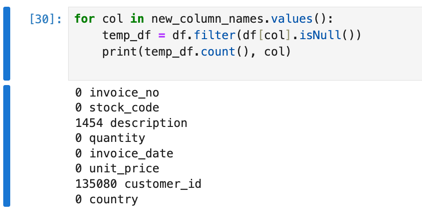
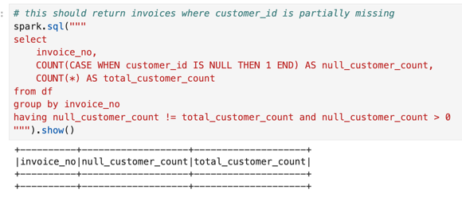

My local environment consists of running a docker container with [jupyter/pyspark-notebook](https://hub.docker.com/r/jupyter/pyspark-notebook) image.

How I've solved each task:

***1.1.a)*** [code](https://github.com/victor7070/allcloud-assignment/blob/main/shared.py#L41-L49)

***1.1.b)*** [code](https://github.com/victor7070/allcloud-assignment/blob/main/shared.py#L53-L56)

***1.1.c)*** [code](https://github.com/victor7070/allcloud-assignment/blob/main/shared.py#L91-L112) \
Notes:

***Handling null values*** \
I've checked every column for missing values and the most prominent one is `customer_id`.

Out of curiosity, I've tried to see if `customer_id` can be extracted from other transactions within the same invoice but that doesn't seem feasible as there are invoices where all the transactions are missing the `customer_id` (see the ss below).

At this point, I think it's fair to say that these records provide no value, so we can simply drop them.

***Cancelled invoices*** \
I figured I'd better clean the dataset and remove cancelled invoices as there was no need/requirement for them.

***Duplicates*** \
Regarding the duplicate records, I've conducted my own analysis and I've discovered some products might appear multiple times within an invoice but with different quantities and price per unit. If there were a specific requirement I would've spent more time addressing this but for the sake of simplicity I'll consider duplicate records the ones that have the same `invoice_no`, `stock_code`, `quantity`, `unit_price`.

***1.2.a)*** in `analysis.ipynb`

***1.2.b)*** in `analysis.ipynb` \
Notes: \
In order to get a cleaner result for this exercise, I've decided to use `ROW_NUMBER()` instead of `RANK()` because I noticed there may be multiple "top 1" products for a specific `country`.

***1.2.c)*** in `analysis.ipynb`

***2.1.a)*** [code](https://github.com/victor7070/allcloud-assignment/blob/main/shared.py#L117)

***2.1.b)*** [code](https://github.com/victor7070/allcloud-assignment/blob/main/shared.py#L118-L119)\
Notes: \
The reason I've added `order_year` as well is because this dataset contains invoice dates from 2010-12 to 2011-12, so there would've been a clash between the last months of each year if I didn't do this.

***2.1.c)*** in `analysis.ipynb`

***3.1.a)*** [code](https://github.com/victor7070/allcloud-assignment/blob/main/shared.py#L39-L59)

***3.1.b)*** [code](https://github.com/victor7070/allcloud-assignment/blob/main/shared.py#L176-L177)

***3.1.c)*** [code](https://github.com/victor7070/allcloud-assignment/blob/main/shared.py#L192) \
Notes: \
Due to the size of the dataset, which is relatively small, and in order to ease my debugging and testing process, I thought I would just output a single csv file.

The structure of the files looks like this:
* `data/raw/` - zip and excel files
* `data/base/` - csv file converted from excel
* `data/transformed/` - csv file processed and transformed with pyspark

***3.1.d)*** \
Notes: \
I've added multiple logs throught the entire `shared.py` file in order to make the etl job more verbose and to help us understand the stages this job goes through. \
Regarding error handling, I haven't implemented any logic as this prototype is quite error-free and the logs do a decent job showing the progress of the workflow. \
However, I noticed that sometimes the online repository would give me a `502` response when I called it a couple of times in a row. For the time being I've bypassed that with a [flag](https://github.com/victor7070/allcloud-assignment/blob/main/shared.py#L40) to skip that step as I already have the excel file on my local, but that request failure could be handled with something like an exponential backoff.

***3.2.a)*** [code](https://github.com/victor7070/allcloud-assignment/blob/main/shared.py#L159-L167) \
Notes: \
The `etl_mode` flag dictates how to run the pipeline (either in **incremental** or **refresh** mode). \
If there is no csv file in `data/base/`, the job will download and convert the excel file and process it entirely. Then, if we run the job again in **incremental** mode, it will [create](https://github.com/victor7070/allcloud-assignment/blob/main/shared.py#L160-L164) a dummy csv (update an existing record and add a new record in the latest csv file from `data/base/` folder), extract just the modified records and process them.

***3.2.b)*** [code](https://github.com/victor7070/allcloud-assignment/blob/main/shared.py#L120) 

***3.2.c)*** [code](https://github.com/victor7070/allcloud-assignment/blob/main/shared.py#L186-L188) \
Notes: \
The records that have changed are identified by using the `hash_id` and `latest_processed_date` fields and the transformed csv file will be overwritten.

***3.2.d)*** [code](https://github.com/victor7070/allcloud-assignment/blob/main/shared.py#L166-L167) \
Notes: \
Using `etl_mode` **refresh** will process the extracted csv file again and overwrite transformed data. This behaviour can be observed in the last execution of the `etl.ipynb` file.

***3.3*** \
Certainly, the ETL job I've created is not designed to be efficient and is instead intended for demonstration purposes. \
Optimizations I would make:
- carefully redesign the code to avoid expensive operations like `count()` and `groupBy()` which trigger full data scans and preceding transformations in the query plan
- use data partitioning to enhance the paralelism
- write the output files in parquet format as it's highly optimised for large datasets
- closely monitor the job and ensure the cluster has enough resources